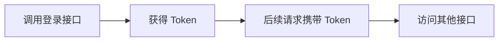

# API 接口文档

## 快速导航

项目提供了 **Knife4j** 可视化接口文档，访问地址：`http://localhost:10001/doc.html`

> 💡 **新手提示**：Knife4j 是一个增强版的 Swagger 文档工具，可以在浏览器中直接测试接口，无需安装额外工具。

## 如何使用接口

### 第一步：理解认证方式

大部分接口需要登录后才能使用，系统采用 **JWT Token** 认证：



**简单理解**：
- Token 就像一张"通行证"，登录成功后系统会给你
- 之后每次请求都要带上这张"通行证"
- 在请求头中添加：`Authorization: Bearer <你的token>`

### 第二步：了解哪些接口不需要登录

以下接口是公开的，无需 Token：

| 接口路径 | 用途 |
|---------|------|
| `/login/**` | 用户登录 |
| `/register/**` | 用户注册 |
| `/conversation/generate` | 生成会话ID |
| `/platform/model/**` | 查询可用模型 |
| `/chat/message` | 发起聊天 |
| `/doc.html` | API 文档页面 |

> ⚠️ **注意**：`/chat/message` 虽然无需登录，但生产环境建议限制访问。

### 第三步：设置语言偏好

系统支持国际化，可通过 HTTP 请求头指定语言：

```http
Accept-Language: zh-CN
# 或
Accept-Language: en-US
```

前端会自动根据用户设置添加此请求头。后端会根据此头部返回对应语言的错误消息和枚举描述。

## 三大核心功能模块

### 👤 模块一：用户认证

#### 1. 用户注册

**步骤 1：检查用户名是否可用**

```http
GET /register/checkUsername?username=zhangsan
```

**返回示例**：
```json
{
  "errorCode": "00000",
  "data": true,  // true 表示可用，false 表示已被注册
  "userTip": "用户名可用"
}
```

**步骤 2：注册账号**

```http
POST /register/username
Content-Type: application/json

{
  "username": "zhangsan",
  "password": "123456"
}
```

#### 2. 用户登录

```http
POST /login/username
Content-Type: application/json

{
  "username": "zhangsan",
  "password": "123456"
}
```

**返回示例**：
```json
{
  "errorCode": "00000",
  "data": "eyJhbGciOiJIUzI1NiIsInR5cCI6IkpXVCJ9...",  // 这就是 Token
  "userTip": "登录成功"
}
```

> 💡 **提示**：登录成功后，请保存 `data` 字段中的 Token，后续所有需要认证的接口都要带上它。

---

### 💬 模块二：AI 聊天功能

#### 1. 开启一次对话（完整流程）

**第一步：获取会话 ID**

```http
POST /conversation/generate
```

**返回**：
```json
{
  "errorCode": "00000",
  "data": "1234567890123456789"  // 这就是会话 ID
}
```

> 💡 **什么是会话 ID**？就像聊天窗口的唯一编号，同一个窗口内的对话都用这个 ID。

**第二步：发送消息**

```http
POST /chat/message
Content-Type: application/json
Authorization: Bearer <你的token>

{
  "platform": "ALIYUN",                  // 使用哪个 AI 平台（阿里云/DeepSeek/Ollama）
  "model": "qwen-plus",                  // 具体模型
  "conversationId": "1234567890123456789", // 上一步获取的 ID
  "message": "你好，请介绍一下 RAG 技术",  // 用户问题
  "knowledgeType": null,                 // 不使用知识库就填 null
  "options": {
    "temperature": 0.7                   // 创造性参数（0-1，越大越发散）
  }
}
```

**响应方式**：流式返回（SSE）

系统会像打字机一样逐字返回结果，每一块数据格式：

```text
data: {"content":"你好"}
data: {"content":"，RAG"}
data: {"content":" 技术是..."}
```

#### 2. 查看历史聊天记录

**查看所有会话列表**：

```http
GET /chat/history/conversations
Authorization: Bearer <你的token>
```

**返回示例**：
```json
{
  "errorCode": "00000",
  "data": [
    {
      "conversationId": "1234567890123456789",
      "title": "关于 RAG 技术的讨论",
      "createTime": "2024-01-01 10:00:00"
    }
  ]
}
```

**查看某个会话的详细记录**：

```http
GET /chat/history/memories?conversationId=1234567890123456789
Authorization: Bearer <你的token>
```

#### 3. 删除会话

```http
DELETE /chat/history/conversation/1234567890123456789
Authorization: Bearer <你的token>
```

---

### 📚 模块三：知识库管理

#### 1. 创建知识库

**步骤 1：检查名称是否可用**

```http
GET /knowledge/checkName?name=我的知识库
Authorization: Bearer <你的token>
```

**步骤 2：创建或编辑**

```http
POST /knowledge/addEdit
Authorization: Bearer <你的token>
Content-Type: application/json

{
  "name": "我的知识库",
  "description": "存放公司技术文档"
}
```

#### 2. 上传文档到知识库（完整流程）

**第一步：上传文件**

```http
POST /knowledge/file/uploadFile/123
Authorization: Bearer <你的token>
Content-Type: multipart/form-data

--boundary
Content-Disposition: form-data; name="files"; filename="document.pdf"

[文件内容]
```

**返回：解析后的分段**
```json
{
  "errorCode": "00000",
  "data": [
    {
      "id": "file_001",
      "fileName": "document.pdf",
      "details": [  // 文档已经被切分成多个小段
        { "id": "detail_001", "content": "第一段内容..." },
        { "id": "detail_002", "content": "第二段内容..." }
      ]
    }
  ]
}
```

> 💡 **为什么要切分**？因为 AI 一次只能处理有限的字符，把长文档切成小段更容易检索。

**第二步：保存到向量库**

```http
PUT /knowledge/file/add/123
Authorization: Bearer <你的token>
Content-Type: application/json

{
  "id": "file_001",
  "description": "公司产品说明书",
  "embeddingModelId": 5,  // 选择用哪个模型将文本转换为向量
  "details": [
    { "id": "detail_001", "content": "第一段内容..." },
    { "id": "detail_002", "content": "第二段内容..." }
  ]
}
```

#### 3. 查看知识库中的文件

```http
GET /knowledge/file/list/123
Authorization: Bearer <你的token>
```

#### 4. 删除文件

```http
DELETE /knowledge/file/del/file_001
Authorization: Bearer <你的token>
```

### 3.5 模型与平台管理（Model & Platform）

- **GET `/model/chat/list`**
  - 功能：查询所有可用的聊天模型列表（仅返回启用的模型）。
  - 返回：`VO<List<ChatModelVO>>`，其中包含：平台、模型编码、模型名称、类型 `ChatModelTypeEnum`、是否启用、排序等。

- **GET `/platform/chat/list`**
  - 功能：查询聊天平台列表及其配置信息。
  - 返回：`VO<List<ChatPlatformVO>>`。

- **PUT `/platform/chat/edit`**
  - 功能：编辑聊天平台配置。
  - 请求体：`ChatPlatformEditRequest`。

- **GET `/platform/model/{type}/list`**
  - 功能：根据模型类型查询模型列表。
  - 路径参数：`type`，取值为 `CHAT`（聊天模型）或 `EMBEDDING`（嵌入模型），枚举 `ChatModelTypeEnum`。
  - 返回：`VO<List<ChatModelVO>>`。

- **PUT `/platform/model/{type}/edit`**
  - 功能：编辑指定类型的模型配置。
  - 路径参数：`type`（同上）。
  - 请求体：`ChatModelEditRequest`。
  - 说明：当前安全配置中 `/platform/model/**` 为公开接口，生产环境建议结合网关或调整安全策略限制访问。

## 4. 调用示例

### 4.1 登录示例

```bash
curl -X POST "http://localhost:10001/login/username" \
  -H "Content-Type: application/json" \
  -d '{
        "username": "admin",
        "password": "password"
      }'
```

### 4.2 发起一次聊天示例

```bash
# 1. 先生成会话 ID（无需登录）
curl -X POST "http://localhost:10001/conversation/generate"

# 2. 使用会话 ID 发起聊天（SSE 流式返回）
curl -X POST "http://localhost:10001/chat/message" \
  -H "Content-Type: application/json" \
  -H "Authorization: Bearer <Your-Token>" \
  -d '{
        "platform": "ALIYUN",
        "model": "qwen-plus",
        "conversationId": "<上一步返回的会话ID>",
        "message": "你好，请介绍一下 RAG 技术",
        "knowledgeType": null,
        "options": {
          "temperature": 0.7
        }
      }'
```

> 更多接口定义、枚举类型与字段说明，请以 `http://localhost:10001/doc.html` 中自动生成的在线文档为准。

## 5. AI 工具调用 (Tool Calling)

### 5.1 网页访问工具 (WebVisitTool)

系统内置了 `visit_web` 工具，AI 可在对话过程中自主调用该工具访问网页获取实时信息。

**工具定义**：

| 属性 | 值 |
|------|------|
| 名称 | `visit_web` |
| 描述 | visit a website |
| 参数 | `url` - the url of the website |

**返回格式**：

```text
title: 网页标题
description: 网页描述
body: 网页正文内容...
```

**使用场景**：

- 用户询问实时新闻或最新信息
- 需要访问特定网页获取详细内容
- AI 知识库中没有的实时数据

**错误处理**：

| 错误码 | 说明 |
|--------|------|
| `INVALID_URL` | URL 不合法 |
| `RATE_LIMIT` | 访问频率过高 |
| `HTTP_ERROR` | HTTP 请求错误 |
| `TIMEOUT` | 请求超时 |
| `PARSE_ERROR` | 内容解析失败 |
| `FETCH_ERROR` | 访问失败 |

### 5.2 如何启用工具调用

在聊天请求中，工具默认已注册到聊天模型。AI 会根据用户问题自主决定是否调用工具：

```json
{
  "platform": "ALIYUN",
  "model": "qwen-plus",
  "conversationId": "xxx",
  "message": "帮我查看今天的科技新闻",
  "knowledgeType": null
}
```

AI 会自动判断是否需要访问网页，并调用 `visit_web` 工具获取信息。

## 6. 国际化支持

### 6.1 支持的语言

| 语言代码 | 语言名称 |
|----------|----------|
| `zh-CN` | 简体中文（默认） |
| `en-US` | English |

### 6.2 后端国际化

后端通过 `Accept-Language` 请求头识别语言，返回对应语言的：

- 错误消息（`userTip` 字段）
- 枚举描述（如平台名称、模型类型等）

**示例**：

```http
GET /platform/chat/list
Accept-Language: en-US
```

返回：
```json
{
  "errorCode": "00000",
  "data": [
    {
      "platform": "ALIYUN",
      "platformName": "Aliyun",
      ...
    }
  ]
}
```

### 6.3 前端国际化

前端使用 Vue I18n 实现：

- 自动检测浏览器语言
- 用户可在设置页面切换语言
- 语言设置保存在 `localStorage`
