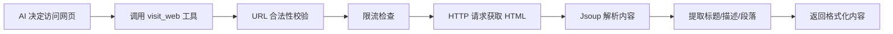
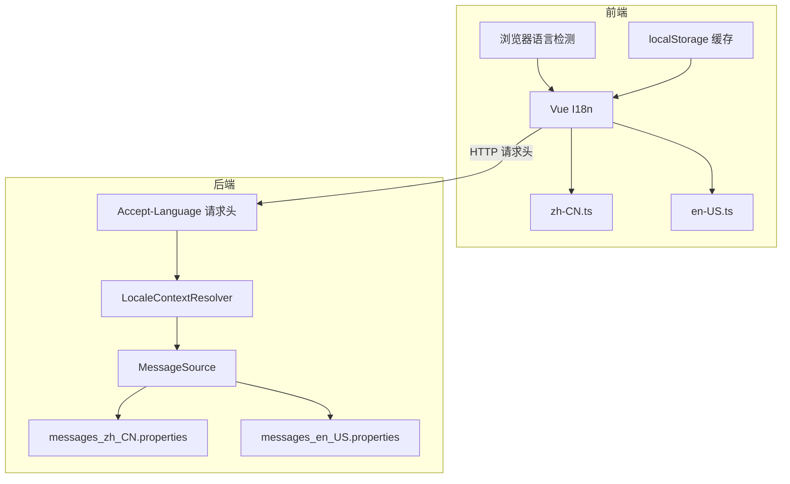

# 项目概述与架构设计

## 1. 项目简介

**Spring AI RAG Platform** 是一个基于 Spring Boot 3 和 Spring AI 构建的企业级 RAG（检索增强生成）知识库平台。项目采用响应式编程范式（WebFlux + R2DBC），具备高并发处理能力，适合构建私有化 AI 知识库问答系统。

### 核心特点

- **响应式全栈架构**: 后端采用 WebFlux + R2DBC 实现全异步非阻塞 I/O，前端基于 Vue 3 Composition API
- **多模型接入**: 通过策略模式支持 Ollama、DeepSeek、通义千问等多平台 AI 模型，支持多模态与纯文本两种调用方式
- **RAG 知识增强**: 集成 Qdrant 向量数据库，实现语义检索与上下文增强
- **网页访问工具**: 内置 WebVisitTool，支持 AI 自动访问网页、抓取内容并解析提取关键信息
- **国际化支持**: 前后端完整的国际化支持，支持中文/英文双语切换，自动适配浏览器语言
- **流式对话体验**: SSE（Server-Sent Events）实现打字机效果的实时对话
- **JWT 无状态认证**: 基于 Spring Security + JWT 实现安全的 RESTful API

## 2. 技术架构

### 2.1 技术栈一览

| 组件类别 | 技术选型 | 版本 | 说明 |
| :--- | :--- | :--- | :--- |
| **后端框架** | Spring Boot | 3.5.9 | 响应式 Web 框架 |
| | Spring WebFlux | 3.5.9 | 非阻塞式 Reactive Web |
| **AI 集成** | Spring AI | 1.1.2 | 统一的 AI 模型抽象层 |
| | Spring AI Alibaba | 1.1.2.0 | 通义千问接入支持 |
| **数据存储** | MySQL (R2DBC) | 8.0+ | 关系型数据库，异步驱动 |
| | Qdrant | latest | 向量数据库，语义检索 |
| | Redis | 6.0+ | 缓存与会话存储 |
| **安全认证** | Spring Security | 3.5.9 | WebFlux 安全框架 |
| | JJWT | 0.11.5 | JWT 令牌生成与解析 |
| **API 文档** | Knife4j | 4.5.0 | Swagger UI 增强版 |
| | SpringDoc | 2.8.14 | OpenAPI 3 文档生成 |
| **前端框架** | Vue 3 | 3.5.25 | 渐进式 JavaScript 框架 |
| | TypeScript | 5.9 | 类型安全的 JavaScript |
| | Element Plus | 2.13 | Vue 3 UI 组件库 |
| | Pinia | 3.0 | Vue 3 状态管理库 |
| | Axios | 1.13 | HTTP 请求库 |

### 2.2 代码分层与模块划分

项目采用 DDD（领域驱动设计）的思想进行分层：

```
src/main/java/cn/krismile/ai/agent/
├── configuration/         # 配置层
│   ├── database/          # 数据库配置（R2DBC、Jackson 转换器）
│   ├── security/          # 安全配置（JWT Filter、异常处理器）
│   ├── doc/               # API 文档配置
│   ├── I18nConfiguration  # 国际化配置（MessageSource、LocaleResolver）
│   └── ChatConfiguration  # AI 聊天配置（文件存储等）
├── controller/            # 控制器层（RESTful API）
│   ├── chat/              # 聊天相关：ChatController、ChatMemoryController
│   ├── knowledge/         # 知识库：KnowledgeController、KnowledgeFileController
│   └── user/              # 用户：UserController、LoginController
├── model/                 # 数据模型层
│   ├── domain/            # 域对象（DO，对应数据库表）
│   ├── request/           # 请求参数定义（Request DTO）
│   ├── response/          # 响应参数定义（VO）
│   └── enumeration/       # 枚举类型
├── repository/            # 数据访问层（R2DBC Repository）
├── structure/             # 业务逻辑层（核心领域逻辑）
│   ├── authorization/     # 认证授权：登录、注册、JWT 验证
│   ├── chat/              # 聊天功能
│   │   ├── chatmodel/       # 模型管理（ChatModelFactory、ChatModelService）
│   │   ├── conversation/    # 会话管理（生成与验证 ConversationId）
│   │   ├── knowledge/       # 知识库服务
│   │   ├── memory/          # 聊天记忆服务（ChatMemory）
│   │   ├── model/           # 聊天策略模式实现
│   │   │   ├── strategy/     # 各平台策略：AliYunChatStrategyImpl、DeepSeekChatStrategyImpl
│   │   │   └── ChatStrategy  # 策略接口
│   │   └── platoform/       # 平台配置管理
│   └── rag/               # RAG 检索增强
│       ├── embedding/       # 向量化：VectorStoreBuilder、QdrantVectorStoreBuilder
│       └── file/            # 文件解析：FileParser、FileService
├── exception/tool/         # 工具异常定义
│   └── WebVisitException   # 网页访问异常
└── util/                  # 工具类：加密、JSON处理、雪花ID生成器
```

**关键设计点**：

1. **策略模式支持多平台**：`ChatPlatformEnum` 枚举定义了 `OLLAMA`、`DEEPSEEK`、`ALIYUN` 等平台，每个平台对应一个 `ChatStrategy` 实现类，通过 `enum.strategy()` 方法获取具体策略。

2. **模型类型分离**：`ChatModelTypeEnum` 区分 `CHAT`（聊天模型）和 `EMBEDDING`（嵌入模型），实现聊天与向量化模型的独立管理。

3. **响应式编程**: 所有 Service 层返回 `Mono<T>` 或 `Flux<T>`，Repository 使用 `ReactiveCrudRepository`，实现端到端的非阻塞异步处理。

4. **安全过滤链**：`AuthenticationWebFilter` 在请求到达 Controller 前拦截，解析 JWT Token 并注入到 `ReactiveSecurityContext` 中，后续通过 `SecurityUtils.getCurrentUserId()` 获取当前用户 ID。

5. **国际化架构**：`I18nConfiguration` 配置 `MessageSource` 和 `LocaleContextResolver`，前端通过 `Accept-Language` 请求头传递语言设置，后端根据请求头自动切换消息语言。

6. **AI 工具调用**：`WebVisitTool` 作为 Spring AI Tool 注册到聊天模型中，AI 可自主决定是否调用该工具访问网页获取实时信息。

### 2.3 核心设计模式

#### 策略模式：多平台 AI 模型适配

项目通过策略模式实现了多 AI 平台的统一接入：

```java
// ChatPlatformEnum 枚举定义平台与其策略实现的绑定
public enum ChatPlatformEnum {
    OLLAMA("ollama", "Ollama", OllamaChatStrategyImpl.BEAN_NAME),
    DEEPSEEK("deepseek", "Deepseek", DeepSeekChatStrategyImpl.BEAN_NAME),
    ALIYUN("aliyun", "阿里云", AliYunChatStrategyImpl.BEAN_NAME);
    
    // 通过 enum.strategy() 直接获取策略实例
    public ChatPlatformStrategy strategy() {
        return SpringUtils.getApplicationContext()
            .getBean(this.strategyBeanName, ChatPlatformStrategy.class);
    }
}

// Controller 层直接调用策略
@PostMapping("/message")
public Flux<ChatResponse> chat(@RequestBody ChatRequest request) {
    return request.getPlatform().strategy().chat(request);
}
```

**设计优势**：
- 新增平台无需修改 Controller，只需添加枚举值和对应的 Strategy 实现
- 各平台逻辑隔离，互不影响
- 符合开闭原则（OCP）

#### 工厂模式：动态构建 AI 模型

`ChatModelFactory` 根据平台和模型类型动态构建 ChatModel 或 EmbeddingModel：

```java
// 构建聊天模型
Mono<ChatModel> chatModel = ChatModelFactory.builder(ChatPlatformEnum.DEEPSEEK)
    .chat("deepseek-chat", options);

// 构建嵌入模型
Mono<EmbeddingModel> embeddingModel = ChatModelFactory.builder(ChatPlatformEnum.ALIYUN)
    .embedding("text-embedding-v2", options);
```

这种设计使得 RAG 流程中的向量化模型可以由用户在上传文件时自由选择，而非硬编码在配置文件中。

### 2.4 前端架构设计

前端采用 Vue 3 + TypeScript + Pinia 的现代化架构：

#### 目录结构

```
website/src/
├── api/                  # API 接口封装
│   ├── api-client.ts     # Axios 客户端配置（拦截器、错误处理）
│   ├── auth-api.ts       # 认证相关接口
│   ├── chat-api.ts       # 聊天接口（包含 SSE 流式处理）
│   ├── knowledge-api.ts  # 知识库接口
│   └── model.ts          # 类型定义和统一响应格式 VO<T>
├── components/          # Vue 组件
│   ├── chat/             # 聊天相关：ChatArea、MessageBubble、SessionList
│   ├── knowledge/        # 知识库：FileUpload、KnowledgeDetail
│   ├── settings/         # 设置页面：AIProviderSettings、AIModelList
│   └── common/           # 通用组件：SidebarNav、LoginDialog
├── stores/              # Pinia 状态管理
│   ├── auth.ts           # 认证状态：token、登录/注册逻辑
│   └── chat.ts           # 聊天状态：会话列表、消息历史、模型选择
├── views/               # 页面视图
│   ├── ChatView.vue      # 聊天页面
│   ├── KnowledgeBase.vue # 知识库管理
│   └── SettingsView.vue  # 设置页面
└── router/              # Vue Router 路由配置
```

#### 核心特性

**1. 状态管理**：

- `auth.ts`：管理用户登录状态、JWT Token，自动从 `localStorage` 恢复登录状态
- `chat.ts`：管理会话列表、消息历史、当前选中模型，实现会话切换时自动加载历史

**2. SSE 流式响应处理**：

```typescript
// chat-api.ts 中使用 Fetch API 处理 SSE
const response = await fetch('/api/chat/message', {
  method: 'POST',
  headers: { 'Authorization': `Bearer ${token}` },
  body: JSON.stringify(chatRequest)
});

const reader = response.body.getReader();
const decoder = new TextDecoder();

// 逐行解析 SSE 流，处理 data: {"content":"...","reasoningContent":"..."}
```

**3. API 请求拦截**：

- 请求拦截器：自动添加 `Authorization` 头
- 响应拦截器：统一处理错误码，`A0301` 认证失败时清除 token
- 错误提示：优先展示 `userTip` 字段，用户友好

## 3. 核心业务流程

### 3.1 RAG 流程

1. **文档上传**：用户通过 `/knowledge/file/uploadFile/{knowledgeId}` 上传 PDF、Markdown 等文档；
2. **文档解析**：后端根据文件后缀选择合适的 `FileParser`，完成文本抽取与预处理；
3. **文本切片**：将长文本切分为适合的片段（`Document`），并附加元数据（如用户 ID、文件 ID 等）；
4. **向量化模型选择**：用户在保存文件时通过 `embeddingModelId` 显式选择使用的 **嵌入模型**；
5. **向量化**：系统调用对应平台下的嵌入模型，将文本片段转为向量；
6. **向量存储**：通过 `VectorStoreBuilder` 及 `QdrantVectorStoreBuilder` 构建 Qdrant 向量库，并将向量写入指定集合；
7. **检索与生成**：用户发起聊天请求时，根据是否启用知识库（`knowledgeType`）决定是否执行向量检索，将检索到的片段作为上下文与用户问题一起发送至聊天模型生成回复；
8. **聊天记忆**：会话内容通过 `ChatMemory`（基于数据库实现）进行持久化，用于后续多轮对话。

### 3.2 聊天与会话流程

1. **生成会话 ID**：前端调用 `/conversation/generate` 获取会话 ID，并在后续请求中复用；
2. **发起对话**：前端调用 `/chat/message`，传入平台、模型编码、会话 ID、用户消息以及可选的知识库配置；
3. **流式响应**：接口以 SSE 流形式返回 `ChatResponse`，前端可边接收边渲染；
4. **历史记录查询**：通过 `/chat/history/conversations` 与 `/chat/history/memories` 查询会话列表和具体历史记录；
5. **会话清理**：通过 `/chat/history/conversation/{conversationId}` 删除不再需要的会话及其历史信息。

### 3.3 前后端交互详解

#### SSE 流式响应处理

后端通过 `Flux<ChatResponse>` 返回流式数据，前端使用 Fetch API 逐行解析：

```typescript
// 前端处理逻辑（chat.ts store）
await sendChatMessage(chatRequest, {
  onMessage: (content: string, reasoningContent?: string) => {
    // 处理 reasoningContent（AI 思考过程）
    if (reasoningContent) {
      message.reasoningContent += reasoningContent;
      message.isThinking = true;
    }
    
    // 处理 content（正式回复）
    if (content) {
      message.isThinking = false; // 结束思考
      message.content += content;
    }
  },
  onError: (error, userTip) => {
    // 显示错误提示
    ElMessage.error(userTip || '请求失败');
  },
  onComplete: () => {
    // 流结束，清除加载状态
    message.isLoading = false;
  }
});
```

#### 统一响应格式

所有 API 接口的响应都遵循 `VO<T>` 结构：

```typescript
interface VO<T> {
  errorCode: string;    // "00000" 表示成功
  errorMessage: string; // 开发者错误信息
  userTip: string;      // 用户友好提示
  data: T;              // 实际数据
}
```

前端统一在 Axios 响应拦截器中处理：
- `errorCode === "00000"` 表示成功
- `errorCode === "A0301"` 表示认证失败，自动清除 token
- 其他错误码展示 `userTip` 提示用户

> 更详细的字段说明和接口入参/出参，请参考接口文档 `http://localhost:10001/doc.html`。

## 4. 网页访问工具 (WebVisitTool)

### 4.1 功能概述

`WebVisitTool` 是一个注册到 Spring AI 的工具（Tool），允许 AI 在对话过程中自主访问网页、抓取内容并解析提取关键信息。这使得 AI 能够获取实时网络信息，扩展其知识边界。

### 4.2 核心特性

- **自动解析 HTML**：使用 Jsoup 解析 HTML，提取标题、描述、正文段落
- **智能内容提取**：自动移除脚本、样式等无关元素，保留核心内容
- **限流保护**：使用 Resilience4j RateLimiter 限制访问频率，防止滥用
- **重试机制**：支持超时和服务器错误自动重试
- **指标监控**：集成 Micrometer 记录访问成功/失败指标

### 4.3 工作流程



### 4.4 使用示例

当用户询问需要实时信息的问题时，AI 会自动调用该工具：

```
用户：帮我查看 Spring AI 最新版本的发布说明

AI：我来访问 Spring AI 的官方文档获取最新信息...
[调用 visit_web 工具访问 https://docs.spring.io/spring-ai/reference/]

AI：根据官方文档，Spring AI 最新版本是 1.1.2...
```

## 5. 国际化架构 (i18n)

### 5.1 架构设计

项目采用前后端分离的国际化方案：



### 5.2 后端国际化配置

```java
// I18nConfiguration.java
@Bean
public MessageSource messageSource() {
    ResourceBundleMessageSource messageSource = new ResourceBundleMessageSource();
    messageSource.setBasename("i18n/messages");
    messageSource.setDefaultEncoding(StandardCharsets.UTF_8.name());
    return messageSource;
}

@Bean
public LocaleContextResolver localeContextResolver() {
    AcceptHeaderLocaleContextResolver resolver = new AcceptHeaderLocaleContextResolver();
    resolver.setSupportedLocales(Arrays.asList(Locale.CHINA, Locale.US));
    resolver.setDefaultLocale(Locale.CHINA);
    return resolver;
}
```

### 5.3 前端国际化配置

```typescript
// website/src/i18n/index.ts
const getLocale = () => {
  const saved = localStorage.getItem('app_locale')
  if (saved) return saved

  const language = navigator.language
  if (language.indexOf('zh') > -1) {
    return 'zh-CN'
  }
  return 'en-US'
}

const i18n = createI18n({
  legacy: false, // 使用 Composition API 模式
  locale: getLocale(),
  fallbackLocale: 'zh-CN',
  messages: {
    'zh-CN': zhCN,
    'en-US': enUS,
  },
})
```

### 5.4 语言切换

前端在请求拦截器中自动添加 `Accept-Language` 请求头：

```typescript
// website/src/api/api-client.ts
apiClient.interceptors.request.use((config) => {
  // ... 其他处理
  config.headers['Accept-Language'] = i18n.global.locale.value
  return config
})
```

用户可在设置页面或侧边栏切换语言，语言设置会保存到 `localStorage`。

## 6. 多模态模型支持

### 6.1 概述

项目支持阿里云 DashScope 的多模态模型调用。通过 `multiModel` 参数控制调用方式：

- **多模态模式 (multiModel=true)**：调用 `MULTIMODAL_GENERATION_RESTFUL_URL`，支持图片、文本混合输入
- **纯文本模式 (multiModel=false)**：调用 `TEXT_GENERATION_RESTFUL_URL`，仅支持文本输入

### 6.2 配置方式

在 `PlatformChatOptions` 中，系统会根据模型的 `requestModalities` 自动设置 `multiModel` 参数：

```java
// PlatformChatOptions.java
if (this.options.metaData != null) {
    dashScopeOptions.setMultiModel(Optional.ofNullable(this.options.metaData.getRequestModalities())
            .map(modalities -> modalities.size() > 1)
            .orElse(null));
}
```

### 6.3 使用场景

| 场景 | multiModel 值 | 说明 |
|------|--------------|------|
| 纯文本对话 | false/null | 使用文本生成接口，响应更快 |
| 图片理解 | true | 使用多模态接口，支持图片输入 |
| 文档解析 | true | 支持图片+文本混合内容 |
